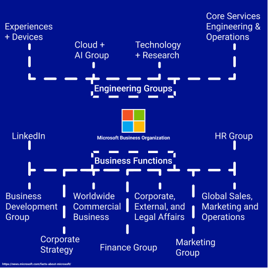
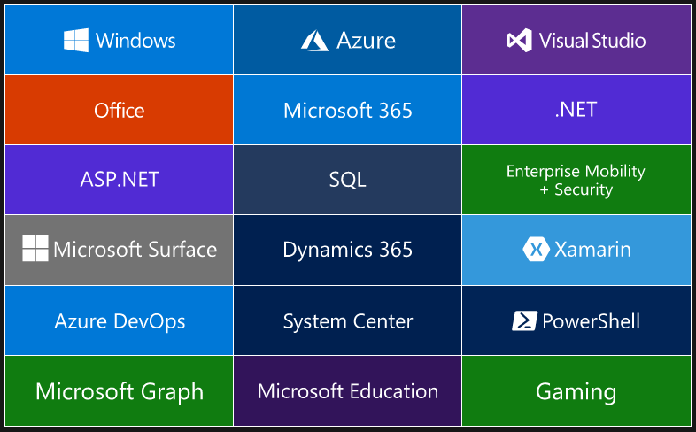
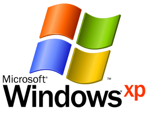
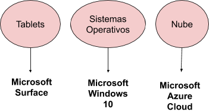

La calidad ha constituido un término ampliamente utilizado desde los años 50, siendo utilizado por primera vez por Walter Shewhart durante una conferencia a miembros japoneses de la JUSE[^1]. A partir de ese momento el término **calidad** acuña un significado más realista y engloba ya una serie de procedimientos, consideraciones y normativas aplicables a cualquier producto/servicio que necesite entrar en vigencia. La creatividad de los japoneses para lograr que sus productos mantengan un nivel alto de satisfacción ha dado paso a la creación de varios procesos de calidad cuya aplicación y seguimiento es indispensable en la actualidad dentro de una organización.

A través de los siguientes minutos de lectura, te explicaré algunos aspecto fundamentales que determinan la calidad dentro de una organización. Vamos, acompáñame?

### Fundamentos de la calidad

- **Calidad**: La calidad de una organización se define por la capacidad de satisfacer las necesidades del consumidor de forma eficiente ya sea en sus procesos o en sus productos y servicios[^3].

- **Bienes y servicios**: Los bienes son los artículos de una empresa que tienen un valor económico capaz de satisfacer las necesidades del consumidor mientras que los servicios son procedimientos realizados por la organización con el mismo fin[^3].

- **Clientes: interno y externo**: Organización o persona que adquiere un producto o servicio de la empresa[^3].

- **Eficiencia**: Relación entre el resultado alcanzado y los recursos utilizados[^3].

- **Eficacia**: Grado en que se realizan las actividades planificadas y se alcanzan los resultados planificados[^3].

- **Efectividad**: Que refiere a la capacidad para entregar resultados planeados[^3].

- **Competitividad**: Capacidad de una organización para competir contra otros establecimientos con sus diferenciadores respectivos[^3].

- **Productividad**: Es la relación obtenida entre los resultados y el tiempo empleado para obtenerlos, entre menos tiempo y mejores resultados, la productividad se considera mejor[^3].

### Conceptos básicos

- **Proceso**: Es el conjunto de operaciones que pueden definirse, medirse y mejorarse dentro de la Organización[^3].

- **Gestión**: Conjunto de actividades coordinadas que permiten mantener la estructura de la organización[^3].

- **Producto**: Es la salida que existe en una organización, sin necesidad que exista de por medio una transacción entre el cliente y la organización, ya que pueden hacer referencia a los servicios[^3].

- **Requerimientos del cliente**: Son las especificaciones y limitaciones que se generan en la fase de requerimientos dentro de la organización.

- **Dimensiones de la calidad**: Es difícil definir la calidad en una sola palabra, es por ello que se analiza la calidad de la organización en 5 pilares fundamentales (Calidad, Entrega, Costo, Seguridad, Ambiente), los cuales se llevan a cabo mediante la buena motivación a los empleados.

> Una vez repasada la teoría, demosle vida a estas definiciones. Y que mejor hacerlo con un ejemplo !

Bien, para el ejemplo vamos a tomar en cuenta a la empresa estadounidense Microsoft. Nos basaremos en una parte de los fundamentos (tú puedes realizar el análisis completo investigando en su [propia web](https://www.microsoft.com/en-us)).

Hablemos un poquito de Microsoft, hoy en día quién no conoce a esta inmensa corporación?

> Microsoft se define a sí misma como una empresa que impulsa la transformación digital a través de la nube, para esto se han propuesto capacitar a cada persona u organización para que logre más[^2].

La distribución de negocios de esta organización se centra en 2 grandes sectores).

#### Gestión de Calidad

Microsoft como toda empresa de tecnología cuenta con procesos certificados de Q&A que se aplican a los diversos productos/servicios que ofertan con la finalidad de ofrecer al usuario final productos con alto rendimiento, seguridad y operabilidad; y servicios con escalabilidad, alta demanda y experiencia de usuario satisfactoria.

#### Eficiencia y Eficacia

El artículo (Comin, 2013) describe a Microsoft como una empresa ágil, de ideas innovadoras y exitosas.
Su innovación frente a la competencia se reflejó con cada uno de sus productos, uno de ellos, es el famoso sistema operativo Windows XP en el año 2000.

De ahí en adelante, el mismo reporte registra nuevos productos que hasta estos tiempos son la insignia de la compañía (fig.4).

#### Competitividad

Una de las grandes ventajas de Microsoft es su apuesta por la informática en la nube[^4] (después del desastroso final para Windows Phone) que le ha permitido establecer una rivalidad con otros grandes como Amazon o IBM. Precisamente la competitividad ha sido uno de los factores determinantes para que la empresa transicione de ofrecer unicamente un sistema operatívo a un enorme conjunto de servicios en la nube[^5] y con ello infinidad de posibilidades.

> Productos con alto rendimiento, seguridad y operabilidad; y servicios con escalabilidad, alta demanda y experiencia de usuario satisfactoria.

<iframe width="560" height="315" src="https://www.youtube.com/embed/aaglPKExHw8" frameborder="0" allow="accelerometer; autoplay; encrypted-media; gyroscope; picture-in-picture" allowfullscreen></iframe>

Ahora bien, una de las claves del éxito de Microsoft es la **retroalimentación** por parte de la comunidad, que se ha transformado en muchos proyectos de código abierto y mejoras (propuestas por los usuarios) en sus productos/servicios privativos. Esto eleva la calidad de la empresa a otro nivel; ya que el enfoque de su producción se centra en ofrecer una mejor experiencia al usuario. **Todos queremos ser tratados bien, no?**

### ¿Qué podemos comcluir?

Existen diversos aspectos para cuantificar la calidad tanto de procesos como de productos dentro de una organización. En un mundo globalizado los retos así como la competencia en el mercado cada vez son mayores, lo que permite desafiar la alta competencia, tanto nivel nacional como internacional.

La calidad dentro de una empresa, sin duda, es un factor importante que produce satisfacción a sus clientes, empleados y accionistas, y dota de herramientas prácticas para una gestión integral. En la actualidad es necesario cumplir con los estándares de calidad para poder competir en un mercado cada vez más exigente.

### Referencias

[^1]: (2020). Union of Japanese Scientists and Engineers. Visitado el 19 de mayo en: [JUSE](https://www.juse.or.jp/english/profile/)
[^2]: (2020). About Microsoft. Consultado el 19 de mayo en: [Microsoft](https://news.microsoft.com/facts-about-microsoft/)
[^3]: (2020). Visitado el 19 de mayo 2020, en: [ISO](https://www.iso.org/obp/ui/es/#iso:std:iso:9000:ed-4:v1:es)
[^4]: (2020). Visitado el 23 de mayo 2020, en: [Qué es el cloud computing?](https://azure.microsoft.com/es-mx/overview/what-is-cloud-computing/)
[^5]: (2020). Visitado el 23 de mayo 2020, en: [Qué es Azure?](https://azure.microsoft.com/es-mx/overview/what-is-azure/)