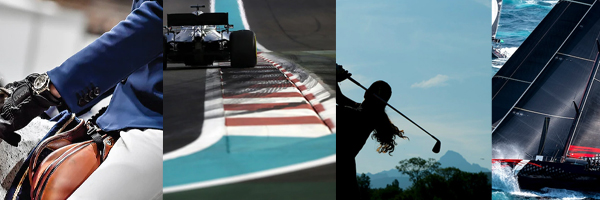

La calidad se percibe como un concepto subjetivo; es decir que se existen diferentes puntos de vista, estas apreciaciones presentan una característica compleja que es la combinación y unificación de todas las percepciones. Dicha combinación se plasma en forma de normativas (estándares) y en la toma de decisiones (por parte de los consumidores).
En este post analizaremos el caso de Rolex y su éxito en el mercado de los relojes.

fig 1. Logo rolex recuperado de: https://www.pinterest.com/pin/572801646326225471/

> Antes de ir al caso práctico, repasemos algo de teoría. A todos nos gusta la teoría no?

### Perspectivas de la Calidad

- **Perspectivas con base en el juicio**: La calidad se aprecia de forma universal y subjetiva a la vez; esto sucede porque cada individuo tiene una manera de percibir las cosas diferente.
- **Perspectivas con base en el producto**: Una de las concepciones de muchos usuarios en cuanto a calidad, está redireccionada al producto/servicio; es decir a la apreciación del mismo mediante los 5 sentidos.
- **Perspectivas con base en el usuario**: Otro de los puntos de vista de la calidad está fundamentado por la apreciación de cada consumidor; cuantos más estándares se desarrolle en base a un gusto y/o necesidad, se establece un nivel de comparación entre productos/servicios.
- **Perspectivas con base en el valor**: Dentro de este punto de vista se encuentra un concepto clave: competitividad. El enfoque de la competitividad en la empresa es el aumento de participación en el mercado; pero son los consumidores quienes en base a un análisis de precio deciden qué producto/servicio van a adquirir.
- **Perspectivas con base en la manufactura**: El último punto de vista de la calidad está relacionado con las buenas prácticas en los procesos de ingeniería (y manufación). Podemos afirmar que este punto de vista es el de una empresa que busca generar calidad aplicando estándares y normativas mundialmente certificadas.

### Dimensiones de la calidad

- **Calidad**: La revista Forbes [^1] califica a Rolex como la marca número uno en relojes de lujo con una utilidad generada de 5 billones de dólares desde su fundación en 1905. A los consumidores les gusta mucho el producto.
- **Entrega**: Según el artículo [^1] Rolex ha implementado modernos canales digitales para la comercialización y envío de sus productos.
- **Costo**: El modelo más económico de Rolex empieza en los 4 mil dólares y se dispara hasta los 500 mil según la exclusividad y modernidad de su cuerpo [^2].
- **Seguridad**: Desde el inicio de su carrera industrial, Rolex empezó a ofrecer garantías de funcionamiento prolongado con condiciones óptimas de sus productos [^1]. Así es el caso de forma que en 1926 patentaron su tecnología contra el agua.
- **Medio Ambiente**: En el 2018, el Fondo Mundial para la Naturaleza calificó a Rolex [^2] como una de las empresas que menos transparencia muestra en su proceso de manufactura. Actualmente más del 50% de la producción aurífera es consumida por la industria de joyerías y esta misma clase de minería es la responsable de varios problema ambientales.

> La calidad se aprecia de forma universal y subjetiva a la vez.

### Caso Práctico

Rolex S. A. es una empresa suiza de relojes de pulsera de lujo y accesorios.​ Sus artículos son considerados símbolos de un alto poder adquisitivo o de estatus económico elevado.

|Perspectivas|Rolex|
|---|---|
|Juicio|Sus artículos son considerados símbolos de un alto poder adquisitivo o de estatus económico elevado.​​ Los productos de esta reconocida marca cuenta con famosos predicadores. Se conoce de importantes personalidades políticas y faranduleras de todo el mundo que portan orgullosos esta marca en diversas fotos de sus redes sociales.[^4]|
|Producto|Rolex no se ha ganado la confianza del mercado por suerte, sino todo lo contrario, mediante duras especificaciones que diferencian su producto de la competencia, como lo indican en su propio sitio web: “Desde siempre, los relojes Rolex han demostrado su valía en las condiciones más extremas imaginables: desde las aguas abisales de los océanos más profundos hasta las cumbres de las montañas más altas; desde el aire hasta las pistas de carreras. Y para garantizar que cada reloj Rolex colma todas las expectativas, se somete cada uno de ellos a pruebas extremas antes de abandonar la sede Rolex.” [^5]|
|Usuario|Rolex maneja con pulso firme el mercado de relojes a nivel internacional, es así que la empresa brinda diferentes modelos orientado a diferentes gustos y necesidades, variando asi tamaños colores y formas, pero siempre manteniendo el prestigio y la calidad que promete la marca.|
|Valor|Mucha gente considera que adquirir un reloj de esta marca cuesta un brazo y una pierna, sin embargo, la verdad es que la empresa cuenta una de las mejores propuestas en relación calidad precio en el mercado, en el cual es posible adquirir relojes de esta marca desde alrededor de 3.500 dólares, y usted podría tener un mítico reloj Submariner usado por James Bond por  5,000 o incluso un Daytona de culto por  8,250, que, en comparación con otras marcas de relojes suizos de lujo, es un precio muy competitivo.|
|Manufactura|Tener un reloj de lujo de baja calidad y corta vida útil no llamaría la atención de los consumidores, es por este motivo que rolex se esfuerza constantemente por conseguir un producto de calidad, a través de un riguroso proceso de desarrollo, desde su elegante diseño, su minuciosamente cuidado desarrollo y sus duras pruebas. En el sitio oficial de la marca se indica que todos los relojes son fabricados a prueba de golpes y a prueba de hermeticidad “Los relojes Rolex deben someterse a más de 20 pruebas de caída distintas antes de su comercialización.” “Todos los modelos Oyster Perpetual están equipados con la caja Oyster, lo que proporciona al movimiento una protección óptima contra agua, polvo y golpes.”|

> Rolex es la empresa con mejor reputación del mundo según el estudio del Reputation Institute [^3]. Ya van tres años en las que Reputation Institute concluye que  Rolex es la empresa con mejor reputación del mundo.

Sin duda los resultados de esta encuesta internacional no son una coincidencia, sino más bien es el reflejo de todos el cuidado que tiene la empresa en cada uno de sus aspectos.

<iframe width="560" height="315" src="https://www.youtube.com/embed/x6_ZSly4EkM" frameborder="0" allow="accelerometer; autoplay; encrypted-media; gyroscope; picture-in-picture" allowfullscreen></iframe>

Cuando se habla de calidad se hace referencia a la percepción que el cliente tiene, ya sea del producto o servicio. Por lo tanto la calidad de un producto o servicio es la percepción que el cliente tiene de los mismos. Lo cual nos lleva a que la calidad es definida en base al contexto en el cual se encuentre.

> Dependiendo del enfoque que se le quiera dar a la calidad dentro de la empresa nos permite ver el papel que desempeña en cada uno de los departamentos de la misma.

### ¿Qué podemos concluir?

Para posicionar una marca en el mercado, se debe dedicar muchísimo tiempo ganando la confianza de los clientes y cumpliendo altos estándares de calidad y procesos.

Para cumplir los estándares de calidad se debe crear todo un proceso para garantizar que los diferentes ámbitos del producto se estén llevando a cabo correctamente.

Rolex no simplemente ha llevado buenos estándares de calidad, sino que los subio al siguiente nivel, haciendo pruebas extremas de calidad.

Existen diferentes perspectivas de la calidad, pero todas llevan a un producto que cumpla con buenas expectativas tanto a sus clientes y creadores.

Rolex se enfocó a la calidad y los mismos clientes se encargaron de posicionar la marca y Rollex lo aprovechó para darle un status bastante elevado.

### Referencias

[^1]: Forbes, 2019. Rolex analytics. Recuperado de: https://www.forbes.com/companies/rolex/#4c52b5945a26
[^2]: Rolex. (n.d.). In ResearchGate. Retrieved May 26, 2020, from https://researchers.uq.edu.au/wikipedia
[^3]: Chesto, Jon (05-11-2018). "Instituto de reputación está en camino a Back Bay". El Boston Globe. Consultado el 6 de diciembre de 2019.
[^4]: Anders, George (09-01-2008). "A medida que la economía se desacelera, la reputación 8 adquiere un significado adicional" . Wall Street Journal . ISSN 0099-9660. Consultado el 6 de diciembre de 2019.
[^5]: Rolex, El mundo de Rolex. Tomado de https://www.rolex.com/es/about-rolex-watches/tested-to-extremes.html Pitofsky, Marina (22/06/2018). "El país más respetado del mundo es ..." USA Today. Consultado el 6 de diciembre de 2019 .
[^6]: Reisinger, Don (01-03-2017). "Apple clasificó detrás de Google en este estudio de reputación corporativa". Fortuna. Consultado el 6 de diciembre de 2019.