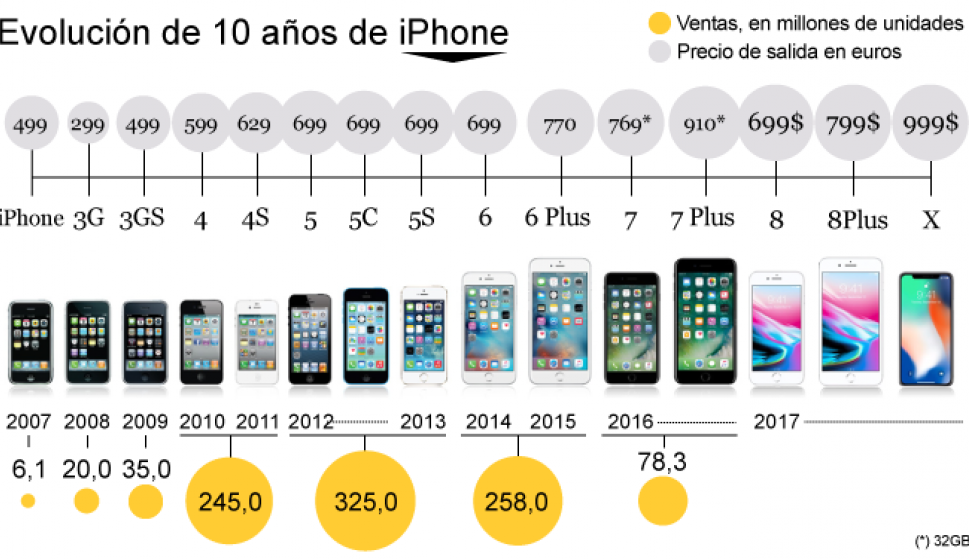

> ¿Qué nivel de calidad han tenido los productos y servicios exitosos en su nacimiento?

Es una buena forma de aterrizar en que la respuesta es cercana a muy baja y no hay
nada más normal que eso.

Necesario resulta mirar hacia uno mismo y comprobar que la dieta con la que se alimenta en la adultez está menos cargada en azúcar que en la niñez, porque en el proceso y paso de los años las personas aprenden de lo perjudicial que es o, en el peor de los casos aparecen enfermedades consecuencias de esos malos hábitos alimenticios.

La palabra “reinventarse” ha sido últimamente muy utilizada pero funciona bien para explicarlo que las ideas y emprendimientos tienen que constantemente evolucionar.

> Vamos a revisar algo de teoría !

### Evolución

Cuando hablamos de la evolución dentro de una empresa se hace referencia al cambio gradual a consecuencia de las ideas, o circunstancias del entorno. En Apple ya son más de 44 años desde que apple entró al mercado y lanzó su primera computadora personal, la Apple(I), desde aquel momento Apple ha ido cambiando drásticamente lo cual se ve reflejado en su crecimiento exponencial. Actualmente cuentan con 1.3 billones de usuarios activos.

### Calidad

La calidad es aquella característica intangible que le atribuimos a un producto o servicio para evaluarla frente a otros productos o servicios del mismo mercado. Apple tienen un diseño sobre el que hay un gran trabajo de fondo y con el que intenta seguir el camino de la modernización, sin olvidar la calidad.

### Caso Práctico. iPhone

Realmente el iphone fue inspirado por el ipod también diseñado por Apple. iPod es una línea de reproductores de audio digital portátiles diseñados y comercializados por Apple Inc. Fue presentado por primera vez el 23 de octubre de 2001 por Steve Jobs.

El primer iphone llamado iphone 3g traía una pantalla táctil capacitiva de 3,5 pulgadas, manejable sin necesidad de stylus y de ahí que haya quedado para el recuerdo la frase pronunciada por Jobs despreciando este tipo de accesorios. 4 Altavoces, micrófono, cámara de 2 megapíxeles y otra serie de características técnicas que en la época eran poco vistas pero que se veían aún más mejoradas con su sistema operativo.

Actualmente el último modelo es el iPhone SE 2 que corresponde a la 14^th generación de iphone conjunto con el iphone 11 y viene con características similares. Como hemos notado el iPhone ha ido evolucionando y mejorando continuamente satisfaciendo las necesidades del mercado.

Cuando hablamos de Apple, siempre tenemos en cuenta toda su tecnología, pasando por software como **iTunes**, **iOS** hasta hardware como el **iPhone**, **iMac**. Todos estos productos que acabamos de mencionar son el resultado de años y años de un proceso prueba y error.

Hablemos de Apple como empresa; con sus momentos de máximo esplendor y puntos de bancarrota ha sabido mantener la posta en cuanto a procesos de mejora continua. Como empresa destaca la aplicación de un plan iterativo que consiste en[^1]:

- Definir un proceso de desarrollo.
- apoyarlo con un entorno desarrollo automatizado.
- Identificar las áreas clave para la mejora del proceso.
- Asignar en cada área la propiedad, determinar la métrica, proporcionar feedback, capacitación y establecer proyectos piloto.
- Apoyar los esfuerzos por mantener este plan en marcha.

Esta es una visión general que contempla la mejora continua; en el caso de Apple, la revisión constante del diseño y la estética de cada uno de sus productos es un ejemplo de la mejora progresiva.

Ahora, Apple como Steve Jobs, es una “bicicleta para la mente”. Este hombre tuvo una visión muy clara en el momento de arrancar con su empresa allá por los 70’s. Las decisiones tomadas por Jobs, no solo nos trajeron productos de calidad, sino que revolucionaron la industria tecnológica mundialmente.

> Mientras él seguía desarrollando procesos de mejora continua con sus productos, les obligaba a sus competidores (y futuros) a desarrollar sus propios procesos para lograr mantenerse al margen.

### ¿Qué podemos concluir?

- La calidad es una cualidad que ha ido evolucionando a través del tiempo, a la par del proceso de producción.
- Las empresas deben mantener un proceso de mejora e innovación continua para poder mantener el liderazgo del mercado.
-  Marcas icónicas, como Apple son referencia de calidad e innovación incrustados en cada uno de los productos que han lanzado al mercado y les ha permitido crear fuertes conceptos de calidad asociados a su marca.

_Si quieres saber más sobre la mente creativa detrás de Apple, te recomiendo el siguiente libro:_

### Referencias

[^1]: Kennett, R. and Baker, E., 2010. Process Improvement And CMMI For Systems And Software. 1st ed. CRC Press, p.6.