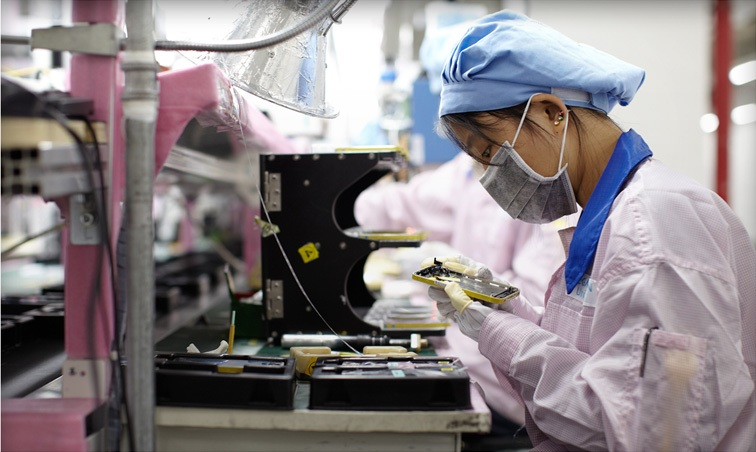

La gran parte de los objetos que utilizamos en nuestra vida cotidiana han pasado por un largo proceso de desarrollo o producción para lograr llegar a nuestras manos. Es durante este proceso mediante el cual este proceso adquiere ciertas características específicas que le otorgan su valor, funcionalidad e inclusive su calidad. Tener un proceso definido permite a la empresa disminuir sus gastos, tener un menor despilfarro, menos repeticiones, menos rechazos, menos reclamaciones y menos devoluciones, lo que se traduce en costes más bajos y en una productividad más alta.

El iPhone es el producto más rentable y más vendido de Apple, se han vendido más de mil millones desde que se lanzó el primero [2]. Sin embargo, cuál es el proceso que realiza la empresa para poner un iphone en sus tiendas. Esta es la historia de cómo un iPhone puede terminar en tus manos.

#### Cómo se fabrican los teléfonos ?

Apple le compra muchas de las partes del iPhone la tarjeta de memoria, el modem, el módulo de la cámara, el micrófono y el controlador de la pantalla táctil, entre otras a más de 200 proveedores en todo el mundo. Foxconn, la empresa taiwanesa que dirige las instalaciones de Zhengzhou, incluso produce algunas partes más pequeñas como las carcasas de metal.

Las instalaciones de Foxconn en Zhengzhou tienen una extensión de 5,6 kilómetros cuadrados y pueden emplear hasta 350.000 trabajadores, muchos de los cuales ganan cerca de 1,90 dólares la hora. En la fábrica se hace el llamado FATP (ensamblaje final), pruebas y empacado.
Al salir de las instalaciones, el iPhone recién ensamblado se transporta unos cientos de metros hasta donde el gobierno chino construyó un enorme centro aduanero, justo en las afueras de la fábrica de Foxconn. La agencia se ubica en una especie de zona libre, lo cual permite que Apple venda los iPhone más fácilmente a los clientes chinos.

Este es el proceso que maneja Apple en la producción de los iPhones no existe en si el proceso de calidad dentro de los componentes ya que son adquiridos de terceros, sin embargo las pruebas finales son con el dispositivo ya ensamblado. Sin embargo aquí adjunto ciertos datos curiosos sobre el control a los proveedores:

> 1.- 451 inspecciones sobre la cadena de suministro de Apple (un 51% más que en 2012). 2.- 1,5 millones de trabajadores participando en iniciativas de formación en derechos laborales, más otros 280.000 recibiendo formación de automejora. 3.- 60 horas de trabajo semanal como como máximo permitido. 4.- 1 millones de trabajadores a los que se le realiza un seguimiento de sus horas extras semanales.

Mientras que el diseño y el software corren de la mano de Apple, hay una apuesta muy sutil; la de utilizar fabricantes externos para la fabricación de la mayoría de componentes hardware. Desde la selección de Aluminio de serie 6000 pasando por hasta el acero inoxidable, la empresa californiana se ha preocupado de que el diseño físico y abstracto sea una de las características más apreciadas por el consumidor. La impresionante administración del proceso de manufactura de FOXXCON, les permite producir hasta 500.000 iPhones en un solo día, una cifra inalcanzable para una pequeña empresa que quiera comenzar en el negocio de la telefonía celular; esto nos demuestra que Apple administra muy bien los procesos internos y utilizan la gestión estratégica a su favor para posicionarse como una de las mejores empresas de los últimos tiempos.

#### Ensamblaje del iPhone
##### Entradas
El proceso del iPhone inició en Asia [^2] donde empresas manufactureras se dedican al ensamblaje del cuerpo del dispositivo. Procesan las materias primas hasta conseguir los componentes electrónicos que se necesitan

##### Sistema
La empresa encargada de todo el proceso se llama Foxconn. Hay 94 líneas de producción en la planta de fabricación de Zhengzhou [1], y se necesitan unos 400 pasos para montar el iPhone, incluyendo pulir, soldar, taladrar y ajustar los tornillos. La instalación puede producir 500.000 iPhones al día, o aproximadamente 350 por minuto.

##### Salidas
Es allí cuando finalmente aparecen los productos finales (fig. 3). Equipos operativos que ya pueden ser enviados a California donde son agrupados y distribuidos.

#### ¿Qué podemos concluir?

- La calidad es una cualidad que ha ido evolucionando a través del tiempo, a la par del proceso de producción.
- Las empresas deben mantener un proceso de mejora e innovación continua para poder mantener el liderazgo del mercado.
- La calidad de los procesos es tan importante como la calidad del producto final.
- Es necesario encontrar proveedores que tengan los mismos objetivos a nivel de calidad y seguridad que tu empresa.

#### Referencias

[^1]: An iPhone’s Journey, From the Factory Floor to the Retail Store. (2020). Retrieved 17 June 2020, from: https://www.nytimes.com/2016/12/29/technology/iphone-china-apple-stores.html
[^2]: Yoffie, D. B., & Rossano, P. (2012). Apple Inc. in 2012. Harvard Business School.
