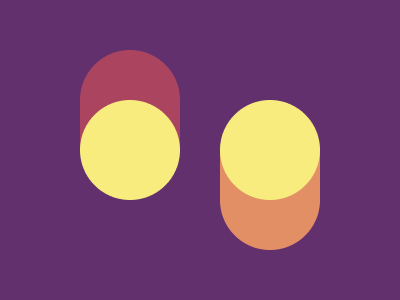

Bien, el día de hoy les comentaré un poco sobre la experiencia de participar en este evento.

Primero lo primero, veamos de que trata esta competencia !

> Code in the Dark - es una competencia de front-end (HTML y CSS), originada en Tictail, donde cada participante compite para implementar el diseño de un sitio web dado solo un screenshot. El truco está en que no se puede previsualizar lo que el desarrollador hace durante la implementación, ni se pueden usar herramientas de medida. El ganador será decidido por la audiencia!

Esto está de locos, basicamente nos estan pidiendo escritura a ciegas y de CSS !

### Como me enteré de esta competencia?

Resulta que en el canal telegram de [JavaScript Ecuador](https://t.me/javascriptecuador), publicaron un tweet sobre el concurso; me encanta curiosear así que entre y me enteré de que se trataba. Leí bien las bases del concurso y me guardé el formulario de inscripción como una snooze tab.

### Indesición!

Soy muy pero que muy cauteloso, me gusta verificar que entendí bien las bases antes de partipicar en alguna de estas competencias. Al principio estuve indeciso de participar (ya tuve una mala experiencia de preparación hace un par de años), pero como siempre digo hay que perder el miedo y lanzarse, al final no pierdes nada y te ganas un momento de euforía y risas. Así que lo hice, me inscribí y en pocas horas me llego un enlace a un canal de organización en Discord.

### El día llego y los nervios tambien!

En el segundo día de la competencía, estaba más o menos listo para mi participación; digo más o menos listo porque me moría de los nervios, en la competencia solo teniamos 15min para replicar los más exacto posible un diseño previo. Y ahí estaba yo 50/50, analizando los **fails** del resto de concursantes, sofocando risas cada vez que el organizador le daba al preview y podiamos ver cada "obra de arte".

Para resumirles, el diseño que me tocó no estuvo para nada complicado, sin embargo, doña nervios atacó y no me permitió pasar tan siquiera de la ronda de eliminatorias.

> Nunca dejen que sus nervios se sobrepongan a sus conocimientos

### Aquí mi resolución al ejericio

Esta es la imagen que me tocó:



Como pueden ver, en realidad no es tan difícil hacer esto en css, hay muchas maneras de abordar la construcción del código.

Veamos, que fue lo que hice yo en el reto:

<!-- TODO: corrgir width -->
<iframe height="600" style="width: 100%;" scrolling="no" title="Reto Coding in the Dark  - 14/06/2020" src="https://codepen.io/jamorocho3/embed/NWxRrpj?height=265&theme-id=dark&default-tab=result" frameborder="no" allowtransparency="true" allowfullscreen="true">
  See the Pen <a href='https://codepen.io/jamorocho3/pen/NWxRrpj'>Reto Coding in the Dark  - 14/06/2020</a> by Jerson Morocho
  (<a href='https://codepen.io/jamorocho3'>@jamorocho3</a>) on <a href='https://codepen.io'>CodePen</a>.
</iframe>

Es un desastre (aunque no tan malo), la forma que logré hacer esta muy bien, sin embargo hay algunas fallas visibles:

- La paleta de colores fue una de la desiciones fatales que tomé (y todo por no haber escuchado que se podía utilizar un color picker), les puse un borde negro en el segundo elemento porque lo dejé en blanco (hay más de 16 millones de combinaciones en <span style="color:red">R</span><span style="color:green">G</span><span style="color:blue">B</span>, y lo único que me acordaba en ese momento era el #FFF y el #000).

- El posicionamiento me jugó tambien una mala pasada, el hecho de haber escrito esto:
```css
.circle2 {
  width: 200px;
  height: 200px;
  background: lightyellow;
  border: 1px solid black;
  position: absolute;
  top: 150px;
  right: 25px; /* el elemento se alinea desde la derecha de la ventana */
  border-radius: 50%;
  z-index: 1000;
}
```

  y haber descuidado el valor del width:
```css
.container {
  background: purple;
  width: 500px; /* era mejor definir un width: 100vw; */
  height: 500px;
}
```

Ahora, vamos a corregirlo utilizando un bendito colorpicker y mejorando posición absoluta:

<iframe height="600" style="width: 100%;" scrolling="no" title="Resolución Reto Coding in the Dark  - 14/06/2020" src="https://codepen.io/jamorocho3/embed/GRojjqM?height=265&theme-id=dark&default-tab=result" frameborder="no" allowtransparency="true" allowfullscreen="true">
  See the Pen <a href='https://codepen.io/jamorocho3/pen/GRojjqM'>Resolución Reto Coding in the Dark  - 14/06/2020</a> by Jerson Morocho
  (<a href='https://codepen.io/jamorocho3'>@jamorocho3</a>) on <a href='https://codepen.io'>CodePen</a>.
</iframe>

Listo, hemos resuelto el reto, ahora el código se ve así:

```css
.container {
  ...
  width: 600px;
  ...
}
.circle2 {
  ...
  top: 150px;
  left: 350px;
  ...
}
.rectangle2 {
  ...
  top: 150px;
  left: 350px;
  ...
}
```

Si ustedes están empezando y nunca han participado en un concurso de programación, **definitivamente tienen que aprovechar esta cuarentena** e inscribirse en uno de estos. El Netflix y las 🍿🍕 pueden esperarles, pero estas oportunidades son únicas.

Para finalizar, si desean revisar más retos como estos, pueden visitar [CSSBattle](https://cssbattle.dev/) y divertirse un rato.

Muchas gracias a [@iosamuel](https://twitter.com/iosamuel) por organizar esta competencia, me divertí mucho, sobre todo en el desempate.

Seguiré codeando 👨‍💻 para traerles algo nuevo !