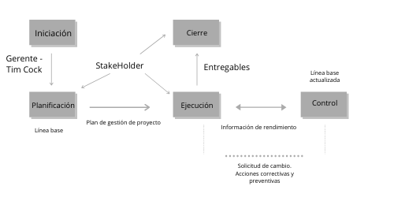

La planificación es esencial para el éxito de cualquier negocio. Cuando una empresa tiene un plan a seguir, los líderes están mejor equipados para prepararse para el futuro. Un plan de negocios crea un enfoque para la empresa, uniendo a los empleados hacia objetivos comunes. Cuando todos trabajan juntos, es más fácil administrar el tiempo y los recursos, para posicionar la compañía para el crecimiento.

Un problema es la diferencia entre lo que se espera y la realidad, esta situación es la mayor preocupación de las empresas, es por eso que se crean diversos procedimientos para la solución de problemas entre ellos el ciclo P.H.V.A Esta  es una herramienta  de mejora continua que brinda una solución la cual busca mantener la competitividad de los productos y servicios.
La aplicación del ciclo Deming de la calidad P.H.V.A. en la solución de problemas busca crear una cultura organizacional en la aplicación de una metodología para resolver problemas recurrentes. El control de procesos, se establece a través del ciclo P.H.V.A, este ciclo está compuesto por las cuatro fases básicas del control:

- Planificar
- Ejecutar
- Verificar y 
- Actuar correctivamente.

#### Planear (P): 
En esta fase se busca establecer objetivos y procesos necesarios para conseguir resultados de acuerdo con los requisitos del cliente y las políticas de organización, además se crea la manera para alcanzar las metas propuestas. 
Esta etapa se divide en 4 pasos a seguir  que consisten en :

- la identificación del problema, 
- descripción del fenómeno, 
- análisis de causas y 
- plan de acción.

En esta etapa se recopilan datos necesarios, y se prioriza las actividades o problemas, y se realiza una búsqueda de soluciones, categorización de propuestas, análisis de presupuestos y finalmente aprobación y asignación de proyectos

#### Hacer (H):
Esta fase se ejecutan las tareas que fueron planificadas en el proceso anterior. se asume que en esta etapa se cuenta con los recursos y medios necesarios para realizar la tarea asignada.

#### Verificar (V):
En esta etapa se realiza el seguimiento de las acciones realizadas, se compara el resultado obtenido con la meta planificada, se miden los procesos y productos contra las políticas, los objetivos y los requisitos, finalmente se informan los resultados.  De esta manera se logra  verificar la evidencia del impacto de la mejora.

#### Actuar (A):
Esta es la etapa en la cual el usuario detectó desvíos y toma acciones para mejorar continuamente el desarrollo de los procesos de modo que el problema no se repita nunca más, esta fase consiste en incorporar los ajustes necesarios que se hayan evidenciado en la fase de verificación. En esta fase es importante garantizar que la experiencia adquirida no solamente en el problema analizado, sino también en la capacidad y habilidad para trabajar en equipo, sirve de base para lograr una mayor efectividad en la solución de problemas futuros.

> Veamos un ejemplo!

Apple Inc,  se alinea con el ciclo PHVA que significa: Planificar, Hacer, Verificar y Actuar, el cual se constituye en una de las principales herramientas de mejoramiento continuo de la organización, con el propósito de permitirle permanentemente la calidad de sus productos ofrecidos. Mejorado la calidad, también le facilita tener una mayor participación en el mercado, una optimización en los costos  y por supuesto una mejor rentabilidad.

> Los resultados de la implantación de este ciclo permiten en las organizaciones una mejora integral de la competitividad, de los productos y servicios, mejorando de forma continua la calidad, reduciendo costos, optimizando productividad, reduciendo precios, incrementando la participación del mercado e incrementando la rentabilidad de la organización.

#### ¿Qué podemos concluir?

- En la aplicación de mejora continua, el ciclo PHVA es completo, porque el proceso cubre desde la planificación hasta la aplicación y es un proceso iterativo: es decir que no tiene un fin establecido, y eso mantiene a la empresa en la búsqueda de nuevas soluciones.
- La actividad conocida como verificación; permite a la empresa hacer una pequeña inspección a fin de medir el impacto del nuevo proceso respecto a su anterior “versión”, de este análisis los datos recopilados permiten a la empresa tomar mejores decisiones.
- Los planes de mejoramiento deben ser desarrollados en un  corto periodo de tiempo (con un máximo de 3 meses), durante este tiempo los indicadores de gestión permiten generar resultados para comprobar si las mejoras son realmente efectivas.

#### Referencias

- The Manufacturing Journey of iPhone. (2018). Retrieved 17 June 2020, from http://www.mechead.com/manufacturing-journey-iphone-factory-floor-retail-store/

- An iPhone’s Journey, From the Factory Floor to the Retail Store. (2020). Retrieved 17 June 2020, from https://www.nytimes.com/2016/12/29/technology/iphone-china-apple-stores.html