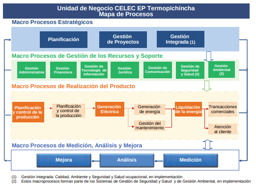

El mapa de procesos es la representación gráfica, o sea el diagrama, de la interrelación existente entre todos los procesos y subprocesos de la empresa. Dicho así, puede parecer fácil de realizar, pero la verdad es que suele ser una tarea ardua que implica a los diferentes departamentos de la empresa.

El objetivo de este mapa es conocer de forma muy detallada y profunda el funcionamientos de los procesos y actividades en los que la empresa está involucrada. Lo suele realizar un equipo con responsables de todos los departamentos, que se ocupan de identificar los procesos, tanto los principales como los secundarios. De hecho, se suele diferenciar tres grandes grupos de procesos de la organización: estratégicos, operativos y de soporte.

Un mapa de procesos es mucho más que un simple diagrama. Cuando está bien hecho, sin errores, aporta mucha información vital para el desarrollo de la actividad de la empresa. Así, esta herramienta se puede utilizar para:

- Detectar ventajas competitivas.
- Identificar posibles mejoras o correcciones, así como nuevas oportunidades para el - negocio.
- Administrar los recursos y actividades de la empresa.
- Identificar los roles claves de la compañía.
- Definir las responsabilidades y funciones de cada empleado.
- Identificar la necesidades actuales y futuras de los clientes.
- Mejorar el flujo de información entre los diferentes procesos y/o departamentos.

### Teoría

Para poder realizar el diseño de un mapa de procesos, tenemos que analizar unos conceptos clave.

#### Proceso

La ISO (International Organization for Standardization) en el estándar 9000:2015[^1] sobre calidad define al proceso como el “conjunto de actividades mutuamente relacionadas que utilizan las entradas para proporcionar un resultado previsto”.

#### Elementos de un Proceso

- Entradas: Responden a criterios de aceptación definidos previamente, a información proveniente de proveedores internos. Las entradas pueden ser físicas, de recursos humanos o técnicos.
- Salidas: El producto final en base a la calidad determinada por el estándar del proceso. Si el proceso es intermedio, el producto generado se convierte en la entrada para el proceso siguiente.
- Recursos: Todos los elementos que son necesarios para desarrollar el proceso eficazmente.
- Controles: Constituyen los lineamientos, restricciones, guía y requisitos que determinan las acciones sobre determinados elementos.
- Propietarios: Son las personas responsables de gestionar el proceso tal y como ha sido definido, encargándose además de controlar la estabilidad del mismo.
- Indicadores: Son variables cualitativas o cuantitativas que miden el funcionamiento del proceso, para así, poder respaldar acciones.
- Clientes: Los usuarios que prueban la salida de un proceso; son internos cuando pertenecen a la misma empresa y externos son los clientes finales.
	
#### Jerarquía de Procesos:

- Procesos clave: Son procesos que tienen más influencia entre el resto de procesos, incidiendo directamente en los objetivos estratégicos y convirtiéndose en puntos críticos para el éxito de la empresa. 
- Subprocesos: Son divisiones específicas de un proceso que determinan una parte del producto específico. 
- Sistema: Estructura organizativa, procedimientos, procesos y recursos necesarios para implantar una gestión determinada, como por ejemplo, la gestión de la calidad, la gestión del medio ambiente o la gestión de la prevención de riesgos laborales. 

#### Mapa de Procesos

Presenta de forma general, un vistazo todos los procesos de la empresa y cómo se relacionan con el resto del entorno. No existe una regla definida para construir el mapa, sin embargo los procesos que se presentan si están definidos:

- Procesos Estratégicos
- Procesos operativos
- Procesos de soporte

Como se ha visto una empresa u organización elabora el mapa de procesos durante la elaboración de su plan estratégico corporativo, con el objetivo de conocer mejor y más profundamente el funcionamiento y el desempeño de los procesos y las actividades en los que se halla involucrado, prestando una atención especial a aquellos aspectos clave de los mismos.

Todo esto con el fin de hacer un modelo gráfico de los procesos con el fin de observar e identificar cómo mejorar u optimizar los procesos dentro de la organización, no obstante nos ayuda a tener claro la jerarquía dentro de la empresa, con lo cual permite tener ya establecidos los procesos a cada responsable, no obstante al hacer esto nos ayuda a evaluar la eficiencia y la eficacia de cada proceso que se realizar dentro de la empresa.

#### Veamos un ejemplo !

Como se puede observar en el Mapa de Procesos presentado en la imagen anterior, la Unidad de Negocio CELEC EP – TERMOPICHINCHA, para implementar el Sistema de Gestión de Calidad ha identificado cuatro Macroprocesos, donde se establecen los procesos necesarios para el Sistema de Gestión de la Calidad; se determina su secuencia e interacción y los criterios y métodos para asegurar la eficacia de su operación y control.

1. Macroprocesos Estratégicos
2. Macroprocesos de Gestión de Recursos y Soporte
3. Macroprocesos de Realización del Producto
4. Macroprocesos de Medición Análisis y Mejora

Adicionalmente, se asegura la disponibilidad de recursos e información para la realización del producto y se realiza el seguimiento, medición y análisis de ellos para implementar las acciones necesarias a fin de obtener los resultados planificados y la mejora continua de estos procesos.

##### Macroprocesos Estratégicos

La Unidad de Negocio CELEC EP ‐ TERMOPICHINCHA, ha definido los macroprocesos estratégicos como aquellos vinculados al ámbito de las Responsabilidades de la Dirección y los procesos de importancia estratégica para la Unidad de Negocio.
Macroprocesos de Gestión de Recursos y Soporte

A través de los macroprocesos denominados de gestión de los recursos y soporte, la Unidad de Negocio CELEC EP – TERMOPICHINCHA determina, proporciona y mantiene los recursos necesarios para el cumplimiento de las actividades de todos los procesos del Sistema de Gestión de Calidad. Adicionalmente, se incorporan los macroprocesos de Gestión de la Seguridad y Salud y de Gestión Ambiental a fin de continuar promoviendo un entorno seguro y saludable para el cumplimiento de las actividades laborales de sus colaboradores, contratistas y visitantes, y el cuidado y preservación del medio ambiente en la producción de energía eléctrica.

##### Macroprocesos de Realización del Producto

A través de los macro procesos denominados de realización del producto, que se indican en la figura arriba presentada, la Unidad de Negocio CELEC EP Termopichincha, lleva a cabo las actividades la producción y/o prestación del servicio, que busca cumplir con las necesidades y expectativas de sus clientes y de la sociedad, ofreciéndoles energía eléctrica activa y reactiva en las mejores condiciones de calidad técnica

##### Macroprocesos de Medición Análisis y Mejora

En este grupo se han definido los procesos que permiten a la Unidad de Negocio CELEC EP Termopichincha, realizar el seguimiento de los procesos, medirlos, analizarlos y establecer acciones de mejora.

### Qué podemos concluir?

- El mapa de procesos ayuda a la empresa a conocer deficiencias y fugas de recursos innecesarios para poder resolverlos oportunamente
- Los procesos pueden dividirse en subprocesos y a su vez estos más microprocesos haciendo un esquema tan simple que cualquier persona es capaz de comprenderlo
- El mapa de procesos ayuda a identificar la necesidades actuales y futuras de los clientes.
- Cada empresa debería realizar este análisis para poder mejorar sus procesos y ser más competitiva en el mercado

### Referencias

[^1]: ISO. (2020). ISO:9000:2015(es). Retrieved 20 June 2020, from https://www.iso.org/obp/ui/es/#iso:std:iso:9000:ed-4:v1:es
[^2]: Mestres, M. (2020). Identificar y elaborar el mapa por procesos de la empresa. Retrieved 24 June 2020, from https://www.captio.net/blog/identificar-y-elaborar-el-mapa-de-procesos-de-la-empresa