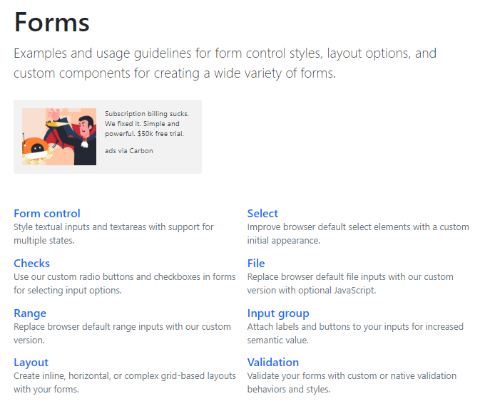

Mientras pensaba cual sería la proxima entrada del blog, me topé con un video de [Bluuweb !]() en mi feed de YouTube hablando sobre Bootstrap 5 😱, así que inmediatamente corrí al blog de ellos para traerles las últimas novedades.

### Qué es Bootstrap y porque te hablo de él?

Si estas iniciando en el mundo de la programación o eres ajeno a las herramientas de la web, déjame presentarte Bootstrap. Es esta especie de framework (de entre tantos caídos del cielo) que nos facilita la construcción de interfaces web. Si, todos aquellos botones, ventanas, alertas, animaciones y cuanta cosa más se nos pueda ocurrir (con la que podamos interactuar en la ventana de nuestro navegador para hacer que se vea cool 😎) si estamos en pesando construir una web (o aprender).

Si nos vamos un poco más a los tecnicismos, nos proporciona un conjunto de:

- Clases css que permiten modificar visualmente la estructura HTML de la web.
- Scripts JavaScript que permiten manipular el [DOM](https://developer.mozilla.org/es/docs/DOM) de la web (interactuar con la página).

Tengo experiencia usando Bootstrap desde su versión 3, poco antes de que lanzaran la versión 4 (allá en el 2017) y puedo decirles significo un cambio grande en la forma de trabajo.

> Dejemos un poco la nostalgia y entremos en materia.

### Qué nos trae esta nueva versión?

#### jQuery e Internet Explorer (Adiós Vaqueros! 🥺)


Una de las mejores novedades, se terminó la dependencia de jQuery.

Todo el código JavaScript ha sido reescrito desde cero con vanilla. Teniendo como resultado un código totalmente limpio y funcional en cualquiera de los navegadores actuales (**al ser una versión alpha, hay bugs aún por identificar**).

jQuery fue la herramienta por excelencia para manipular el DOM durante muchos años y el hecho de que Bootstrap dependiera de ella le estaba limitando las posibilidades de utilizar las caracteristicas que se han implementado en JavaScript en los últimos años.
Cualquier proyecto que se construya desde la v5 en adelante gozará de una mayor ligereza tanto en el peso de los archivos como en la carga del sitio.

> Enhorabuena por el rumbo que esta tomando este proyecto !

#### Para gustos, colores !  🌈

Ahora si podremos personalizar más como se verá nuestro sitio, con la integración de una paleta de colores más extensa.


Una de las partes quizas mas "coloridas", en la v4 disponíamos únicamente de diez colores base:

- primary
- secondary
- success
- danger
- warning
- info
- light
- dark
- white
- transparent

Para esta versión, los colores base se mantienen, la adición en la documentación es una sección llamada "Customize" donde podremos encontrar todos los colores que vemos en la imagen. 👉[Echale un vistazo](https://v5.getbootstrap.com/docs/5.0/customize/color)

#### Una sección reformada para los formularios !  🙌

De esta manera podemos encontrar más facilmente elementos que necesitamos para construir nuestros formularios.



#### Iconos ! Más iconos! NO. Bootstrap Icons 🎉

En un primer vistazo a la versión ```v5.0.0-alpha1```, el equipo de Bootstrap
nos presenta su paquete de iconos propios [Bootstrap Icons](https://icons.getbootstrap.com/).


Anteriormente, Bootstrap recomendaba muchas **icon libraries** que podías añadir con facilidad al proyecto (Material Icons, Fonts Awesome, ...) y eran altamente compatibles.

Según registros de GitHub, la creación de esta librería empieza en julio del año pasado y en la actualidad se encuentra en la versión ```v1.0.0-alpha4 ``` contando con la cantidad inicial de 673 iconos (hasta la fecha). 

> Nada mal para una versión inicial

Por el momento hay varias formas en las que puedes usarlos (todas están en SVG que resulta un poquito largo de escribir):

- SVG puro: 
```html
<svg class="bi bi-chevron-right" width="32" height="32" viewBox="0 0 20 20" fill="currentColor" xmlns="http://www.w3.org/2000/svg">
<path fill-rule="evenodd" d="M6.646 3.646a.5.5 0 01.708 0l6 6a.5.5 0 010 .708l-6 6a.5.5 0 01-.708-.708L12.293 10 6.646 4.354a.5.5 0 010-.708z"/>
</svg>
```
- Usando una ``````: 
```html

```
- Dentro de css: 
```css
.bi::before {
  display: inline-block;
  content: "";
  background-image: url("data:image/svg+xml,<svg viewBox='0 0 16 16' fill='%23333' xmlns='http://www.w3.org/2000/svg'><path fill-rule='evenodd' d='M8 9.5a1.5 1.5 0 1 0 0-3 1.5 1.5 0 0 0 0 3z' clip-rule='evenodd'/></svg>");
  background-repeat: no-repeat;
  background-size: 1rem 1rem;
}
```

#### Todos los temas reunidos en un solo lugar 💪🏽

Así es, ahora ya no tendrás que googlear y googlear para encontrar ese tema que tanto te gusta.

En [themes.getbootstrap](https://themes.getbootstrap.com/) hay una buena cantidad de temas para elegir, eso si, hay que recalcar que son de pago (para apoyar al proyecto y a los designers) y tendrás que invertir algo de dinero para conseguir uno.


Yo he trabajado con [Now UI PRO](https://themes.getbootstrap.com/product/now-ui-kit-pro/) y personalmente te lo recomiendo.

#### Proximamente...  🏁

- Un sistema mejorado de Grid, el sistema actual aún es experimental
- Por fin se añadirá soporte RTL, esto quiere decir que webs que esten en idiomas como el árabe, hebreo, siríaco podrán tener una compatibilidad 100% con el framework.
- Una nueva versión de Bootstrap Modal en la que se está implementando un menú offcanvas.
- Un próximo alpha en 3 - 4 semanas aproximadamente.

Por el momento, en esta versión alpha podemos experimentar y si encontramos errores podemos reportarlos en GitHub.

Gracias por tomarte el tiempo de leer hasta el final, estaré por aquí en un par de dias.

Nos vemos codeando 👨‍💻!