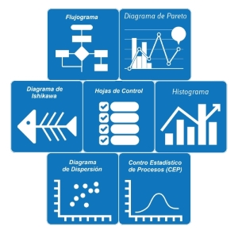

Hoy en día las empresas de todo tipo se encuentran usando herramientas de la calidad para conocer más sobre sus procesos, ingresos y gestión en general. ¿Qué son y por qué son tan útiles? Son un conjunto fijo de técnicas gráficas identificadas como las más útiles en la solución de problemas relacionados con la calidad. Son adecuadas para personas con poca formación en materia de estadística, también pueden ser utilizadas para resolver la gran mayoría de las cuestiones relacionadas con la calidad.

### Cuáles son las herramientas de calidad?

Las siete herramientas básicas están en contraste con los métodos más avanzados de estadística, tales como muestreos de encuestas, muestreos de aceptación, pruebas de hipótesis, diseño de experimentos, análisis multivariados, y los distintos métodos desarrollados en el campo de la Investigación de operaciones.

Según Díaz N. (2003), existen variedad de herramientas que se utilizan en un informe gerencial.

- Diagrama de dispersión: es un tipo de diagrama matemático que utiliza las coordenadas cartesianas para mostrar los valores de dos variables para un conjunto de datos​.
- Diagrama de Pareto: es una gráfica para organizar datos de forma que estos queden en orden descendente, de izquierda a derecha y separados por barras. Permite asignar un orden de prioridades.
- Estratificación o clasificación de datos: clasificar o agrupar los datos con características coincidentes en grupos o estratos
- Gráfica de control: es un diagrama que sirve para examinar si un proceso se encuentra en una condición estable, o para asegurar que se mantenga en esa condición
- Histograma: es una representación gráfica de una variable en forma de barras, donde la superficie de cada barra es proporcional a la frecuencia de los valores representados.
- Hoja de verificación: es un impreso con formato de tabla o diagrama, destinado a registrar y compilar datos mediante un método sencillo y sistemático, como la anotación de marcas asociadas a la ocurrencia de determinados sucesos.

### Y todo esto. ¿Qué nos indica?

Es conveniente realizar mediciones del proceso de mejora continua de la calidad, seleccionando en cada área o departamento los indicadores más adecuados; ya que de esta forma se pueden observar los progresos y establecer cursos de acción. Los indicadores son el mecanismo de diagnóstico y gestión que nos servirán de información para las herramientas de calidad y que ayudarán a saber qué áreas son las problemáticas y, de este modo, poder enfocar los esfuerzos y los recursos hacia ellas.
Como hemos notado, no es necesario ser un experto en el tema para poder implementar estas herramientas en nuestras empresas u organizaciones. En muchas de las organizaciones es indispensable medir la calidad de procesos y productos, por eso  existen algunas características que se denominan críticas para establecer la calidad de un producto o servicio. Lo más común es efectuar mediciones de estas características, obteniendo así datos numéricos. Si se mide cualquier característica de calidad de un producto o servicio, se observará que los valores numéricos presentan una fluctuación o variabilidad entre las distintas unidades del producto fabricado o servicio prestado.

### Veamos un ejemplo !

El siguiente ejemplo veremos un informe gerencial aplicando las herramientas.

<iframe src="https://drive.google.com/file/d/1DsUn607p709NkF3RLfhA0vHWWwglI0Uv/preview" width="640" height="480"></iframe>

### Conclusiones

- El uso de herramientas en base a la calidad, permite que cada empleado se concientice de la importancia de su uso. Además a través del uso se desarrolla una mejor sinergia de trabajo.
- Es importante que se establezcan metas antes de poder utilizar dichas herramientas, ya que con una planificación adecuada no se entorpece el uso de las herramientas.
- La dirección se compromete a implantar y a controlar periódicamente las prácticas y los objetivos de seguridad; solicita a los miembros de Toyota que adopten de forma permanente una actitud de seguridad, y que aplique los estándares y las reglas propias de su lugar de trabajo.
